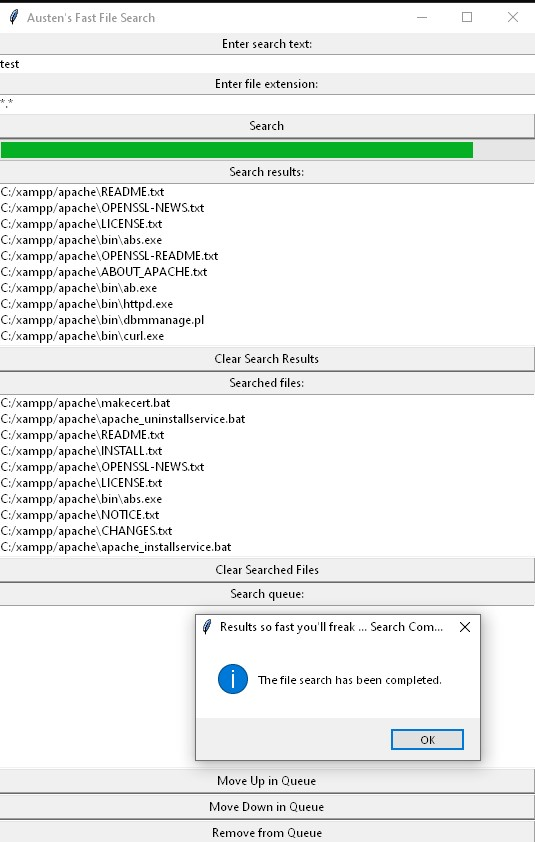

# Austen's Fast File Search

This is a highly efficient, multi-threaded file searching application that uses Python's built-in `tkinter` library for its user interface. The program quickly searches the specified directories for files containing the entered search text. It also allows the user to specify a specific file extension to narrow the search results. The user can view the searched files, found files, and manage search queries in a queue. 

## Features

- Fast file search across your system or specified directory
- Searches file names and file contents
- Search using specific file extensions
- View your search queue, and manage search priorities by moving up/down or removing items
- Copy search results to the clipboard
- Clear search results or searched files list with a single click

## How to use

1. Clone this repository to your local machine.
2. Make sure Python and Tkinter are installed in your system. If not, you can download Python from [here](https://www.python.org/downloads/).
3. Run the Python script (`py Search.py`) to open the GUI.
4. Enter the text you want to search in the first field.
5. Enter the file extension in the second field (use `*.*` to search all files).
6. Click on the `Search` button and choose a directory to start the search. The search button will change to `Cancel` during an active search, allowing you to stop the search if necessary.
7. You can manage your search queue using the `Move Up in Queue`, `Move Down in Queue`, and `Remove from Queue` buttons.
8. Select a result from the search results list and it will be automatically copied to the clipboard.
9. Use the `Clear Search Results` and `Clear Searched Files` buttons to manage your displayed data.

## Contributing

Pull requests are welcome. For major changes, please open an issue first to discuss what you would like to change.

Please make sure to update tests as appropriate.
